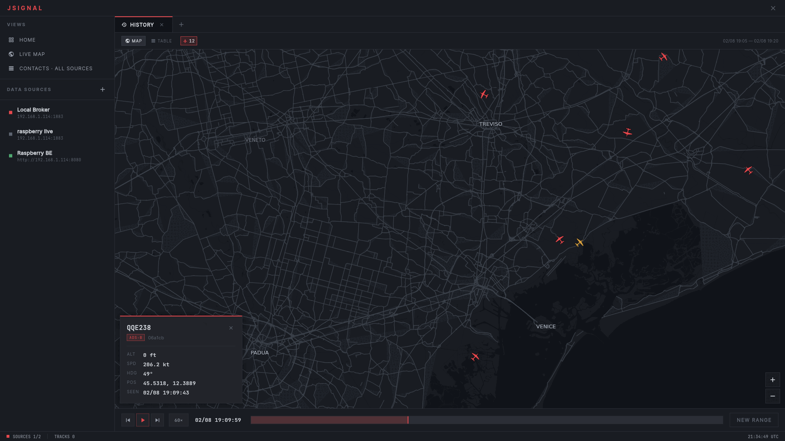
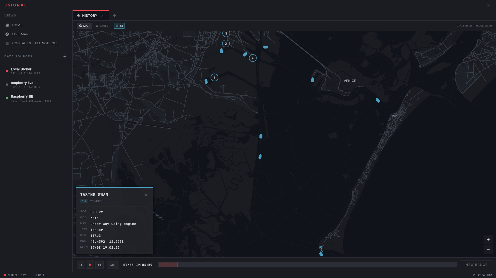
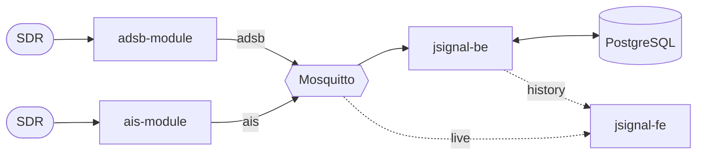
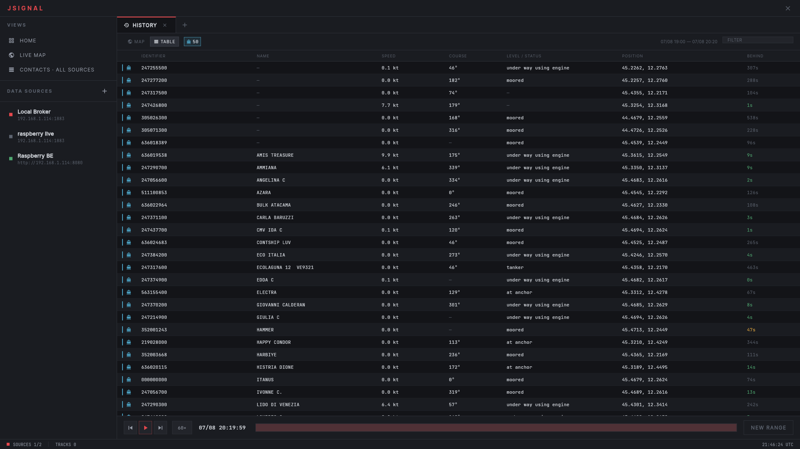

<div align="center">

# JSignal

**Self-hosted signal intelligence.** A toolkit to capture radio signals with an SDR,
analyze them and keep their history.

[adsb-module](https://github.com/jaggornaut/adsb-module) ·
[ais-module](https://github.com/jaggornaut/ais-module) ·
[jsignal-be](https://github.com/jaggornaut/jsignal-be) ·
[jsignal-fe](https://github.com/jaggornaut/jsignal-fe)

</div>


*A departure out of Venice Marco Polo, replayed from the recorded history.*

## Protocols

| Domain | Band | Tracks | Identifier |
|--------|------|--------|------------|
| **ADS-B** | 1090 MHz | aircraft | ICAO24 |
| **AIS** | 162 MHz | vessels | MMSI |


*The same player on AIS: a tanker leaving Marghera down the Malamocco channel.*

## Roadmap

RF drone detection with direction finding, and [ATAK-CIV](https://www.civtak.org/) support.

## Architecture



| Repository | Role |
|------------|------|
| [adsb-module](https://github.com/jaggornaut/adsb-module) | Decodes Mode S at 1090 MHz, publishes JSON to MQTT |
| [ais-module](https://github.com/jaggornaut/ais-module) | Decodes AIS on the marine VHF band, publishes JSON to MQTT |
| [jsignal-be](https://github.com/jaggornaut/jsignal-be) | Records MQTT traffic to PostgreSQL, serves history over REST |
| [jsignal-fe](https://github.com/jaggornaut/jsignal-fe) | Desktop console: live map, contact table, history playback |

Each component runs standalone, and the receivers work with any MQTT consumer.

## Quick start

This repo ships the server stack: MQTT broker, PostgreSQL, recorder backend.

```bash
git clone https://github.com/jaggornaut/jsignal.git
cd jsignal
docker compose up -d
```

Broker on `1883`, history API on `http://localhost:8080` (`curl http://localhost:8080/health`).
Database and schema are created on first start.

Then:

1. Run [adsb-module](https://github.com/jaggornaut/adsb-module) or [ais-module](https://github.com/jaggornaut/ais-module) on the machine with the dongle, with `broker_address` pointing at this host.
2. Run [jsignal-fe](https://github.com/jaggornaut/jsignal-fe) and add two sources from the sidebar: the broker (`<host>:1883`) for live, the backend (`http://<host>:8080`) for history.

To watch the raw feed instead:

```bash
mosquitto_sub -h localhost -t 'adsb/#' -t 'ais/#' -v
```


*The contacts table during an AIS replay.*

## Notes

- The bundled `mosquitto.conf` allows anonymous connections: harden it before exposing the broker outside a LAN.
- See the individual READMEs for native setup, configuration and API docs.
